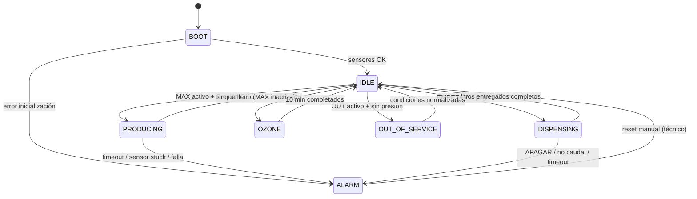

# Lógica de operación — Sistema Kowen

Documento maestro de la lógica de negocio: estados, secuencias operacionales,
riesgos identificados y mitigaciones.

**Estado**: diseño aprobado (2026-05-24), pendiente implementación.

---

## 1. Componentes controlados

### Salidas (vía módulo de relés 8ch)

| CH | Pin | GPIO | Carga | Voltaje |
|---|---|---|---|---|
| CH1 | 36 | 16 | EV #3 llenado botellón | 220V AC |
| CH2 | 35 | 19 | Bomba despacho | 220V AC |
| CH3 | 13 | 27 | EV #1 entrada bombas RO | 220V AC |
| CH4 | 15 | 22 | EV #2 salida RO / flush | 220V AC |
| CH5 | 16 | 23 | Lámpara UV | 220V AC |
| CH6 | 18 | 24 | Generador ozono | 220V AC |
| CH7 | 7 | 4 | Transformador 24V (→ bombas RO) | 220V AC → 24V DC |
| CH8 | 26 | 7 | Reserva | — |

### Entradas (sensores)

| Sensor | Pin | GPIO | Tipo | Estado normal |
|---|---|---|---|---|
| Flotador MAX (lleno) | 32 | 12 | Reed switch | Cerrado cuando lleno (lógica invertida en software) |
| Flotador OUT (vacío) | 12 | 18 | Reed switch | Cerrado cuando vacío |
| Presostato red | 33 | 13 | Switch | Cerrado cuando sin presión |
| Botón EMPEZAR | 29 | 5 | Momentary | Open normalmente |
| Botón APAGAR | 31 | 6 | Momentary | Open normalmente |
| Caudalímetro JR-A168 | 11 | 17 | Hall pulse | Pulsos durante flujo |

---

## 2. Máquina de estados



### Definición de estados

| Estado | Descripción | Cargas activas |
|---|---|---|
| **BOOT** | Arranque del sistema, validación inicial | Ninguna |
| **IDLE** | Máquina lista, esperando eventos | Ninguna |
| **PRODUCING** | Llenando el tanque desde la red | EV #1, EV #2, Bombas RO |
| **DISPENSING** | Vendiendo agua al cliente | Bomba despacho, EV #3, UV |
| **OZONE** | Esterilización periódica del tanque | Generador ozono |
| **ALARM** | Error detectado, requiere atención técnica | Ninguna (todo OFF) |
| **OUT_OF_SERVICE** | Sin agua disponible para venta | Ninguna |

---

## 3. Secuencias operacionales

### 3.1 Secuencia PRODUCING — Llenar tanque

**Trigger**: MAX activo (no lleno) ∧ Presostato inactivo (hay presión de red) ∧ no en cooldown

```
t=0.0s   EV #1 (entrada RO)         → OPEN
t=1.0s   EV #2 (salida RO)          → CLOSED (modo flush)
t=1.5s   Transformador 24V (CH7)    → ON (arrancan 2 bombas RO)
         [Bombas trabajan contra EV #2 cerrada, lavando membrana
          con concentrate flow al drenaje]
t=15.0s  EV #2 (salida RO)          → OPEN (fin flush, producción al tanque)
         [Continúa producción]
         ...
t=??     MAX se desactiva (tanque lleno):
         Transformador 24V (CH7)    → OFF
t=+1.0s  EV #1                      → CLOSE
t=+2.0s  EV #2                      → CLOSE
         Vuelta a IDLE
         [Cooldown: no volver a PRODUCING por 30s]
```

**Salida temprana** (interrupciones):
- Presostato pasa a activo (sin red) → bombas OFF, EV close, alerta "sin red"
- Timeout 60 min sin completar → ALARM "MAX puede estar dañado"

### 3.2 Secuencia DISPENSING — Venta al cliente

**Trigger**: pago confirmado (efectivo/RFID) ∧ EMPEZAR presionado ∧ tanque no vacío

```
t=0.0s   UV (CH5)                   → ON  (esterilización en línea)
t=0.5s   Bomba despacho (CH2)       → ON  (presurizar línea)
t=1.0s   EV #3 (CH1)                → OPEN (apertura al cliente)
         [Caudalímetro cuenta pulsos]
         ...
t=??     Pulsos acumulados = litros_pagados × K_factor:
         EV #3                      → CLOSE
t=+0.3s  Bomba despacho             → OFF
t=+1.0s  UV                         → OFF
         Vuelta a IDLE
         Registrar venta en log
```

**Salidas anormales** (cualquiera de estas → ABORT):
- APAGAR presionado → cierre inmediato (close EV, off bomba, off UV)
- Sin pulsos del caudalímetro en primeros 5s → "pago sin dispensa" alerta crítica
- Sin pulsos por > 10s a mitad de venta → bomba o EV atascada
- Timeout 120s total → exceso peligroso
- OUT pasa a activo durante venta → ABORT, máquina a OUT_OF_SERVICE

### 3.3 Secuencia OZONE — Esterilización periódica

**Trigger**: timer interno (cada 2h desde último ciclo OZONE)

```
t=0.0s    Generador ozono (CH6)     → ON
t=10min   Generador ozono           → OFF
          Vuelta a IDLE
          (siguiente trigger en 2h)
```

**Notas**:
- Independiente de otros estados; puede ejecutarse en background
- Si llega trigger durante PRODUCING o DISPENSING, se posterga hasta IDLE
- No requiere validación de sensores

---

## 4. Análisis de riesgos y mitigaciones

### 4.1 Riesgos durante PRODUCING

| # | Falla | Probabilidad | Severidad | Detección | Mitigación |
|---|---|---|---|---|---|
| P-01 | MAX stuck "no lleno" (cable cortado) | Media | **Crítica** (overflow) | Timeout: bombas > 60 min seguidos | Apagar bombas + ALARM "MAX dañado" + log |
| P-02 | Bombas RO traban (relé soldado ON) | Baja | **Crítica** | MAX detecta lleno pero bombas siguen | Cortar CH7 software + ALARM |
| P-03 | Pierde presión de red durante producción | Alta | Media | Presostato cambia | Apagar bombas + alerta "sin red" → IDLE |
| P-04 | EV #1 stuck cerrada | Baja | Alta | Bombas ON 5 min sin que tanque suba | Apagar bombas + ALARM "EV #1 atascada" |
| P-05 | EV #2 stuck cerrada (no flushea bien) | Baja | Media | Largo plazo: membrana se obstruye | Detección por TDS futuro |
| P-06 | Cable presostato cortado (falso "hay presión") | Media | Alta | Bombas activan pero no sube tanque | Watchdog: si MAX no desactiva en X min, ALARM |
| P-07 | Bombas RO dañadas (no producen) | Baja | Alta | MAX no desactiva en tiempo esperado | Igual que P-06 |

### 4.2 Riesgos durante DISPENSING

| # | Falla | Probabilidad | Severidad | Detección | Mitigación |
|---|---|---|---|---|---|
| D-01 | Cliente paga pero no sale agua | Media | **Crítica** | Caudalímetro 0 pulsos en 5s tras bomba ON | ABORT + alerta Telegram crítica "devolver $X" |
| D-02 | APAGAR mid-venta | Alta | Baja | Botón GPIO 6 | ABORT limpio, log litros parciales entregados |
| D-03 | Bomba despacho stuck ON | Baja | **Crítica** (inundación) | Timeout: bomba > 120s | Cortar TODO + ALARM crítica |
| D-04 | Caudalímetro falla durante venta | Media | Alta | Sin pulsos > 10s a mitad de despacho | ABORT + alerta "caudalímetro?" |
| D-05 | EV #3 stuck open | Baja | Alta | Caudalímetro sigue contando tras "close" | Cortar bomba + ALARM |
| D-06 | Cliente retira botellón a mitad | Alta | Baja | No detectable | Entrega exactamente lo pagado, sin más |
| D-07 | OUT activa mid-venta (tanque se vació) | Baja | Media | Sensor OUT | ABORT + alerta + OUT_OF_SERVICE |
| D-08 | Cable caudalímetro cortado | Baja | Alta | Sin pulsos jamás | Mismo que D-04 |

### 4.3 Riesgos generales / sistema

| # | Falla | Probabilidad | Severidad | Detección | Mitigación |
|---|---|---|---|---|---|
| S-01 | Pi crashea mid-operación | Media | Alta | Watchdog file no actualiza | Hardware: relés caen a OFF (fail-safe). systemd restart al reiniciar Pi |
| S-02 | Power outage | Media | Alta | UPS detecta (futuro) | Sin UPS hoy: posible corrupción SD. Con UPS: shutdown limpio |
| S-03 | Cable sensor MAX cortado | Baja | **Crítica** | Aparece "no lleno" permanentemente | **Vulnerabilidad conocida sin hardware fail-safe**. Mitigación: timeout absoluto + watchdog "tanque debe subir" |
| S-04 | Cable sensor OUT cortado | Baja | Media | Aparece "no vacío" permanentemente | Cross-check con caudalímetro: si vendí > 200L sin OUT activar, sospecha |
| S-05 | Cable presostato cortado | Baja | Media | Aparece "hay presión" permanentemente | Igual que P-06 |
| S-06 | Estados imposibles (MAX y OUT activos juntos) | Baja | Alta | Lógica detecta | ALARM "sensores rotos", OUT_OF_SERVICE |
| S-07 | Pi cuelga sin crashear (ANR) | Baja | Media | Watchdog file no actualiza > 10s | systemd restart |
| S-08 | Backend (Supabase) inalcanzable | Media | Baja | HTTP fail | Encolar eventos local, sync al reconectar |
| S-09 | Telegram bot inalcanzable | Media | Baja | HTTP fail | Reintentar + encolar |
| S-10 | SD card se corrompe | Baja | **Crítica** | Boot falla | Backup periódico, reflashear con imagen base |
| S-11 | Relé soldado ON (cualquiera) | Baja | Variable | Cross-check sensor con comando | ALARM, requiere intervención física |
| S-12 | Cargador débil (undervoltage) | Alta (ya pasó) | Media | dmesg + vcgencmd get_throttled | Cargador adecuado obligatorio en BOM |

---

## 5. Reglas globales de protección

### 5.1 Timeouts máximos por carga

| Carga | Timeout máximo | Razón |
|---|---|---|
| Bombas RO (CH7) | **60 min** continuos | Protección térmica + overflow improbable |
| Bomba despacho (CH2) | **120 s** | Tope > venta más larga esperada (20L a 0.2L/s = 100s) |
| EV #3 (CH1) | **120 s** open | Sincronizada con bomba despacho |
| UV (CH5) | **60 min** continuos | Vida útil de la lámpara |
| Ozono (CH6) | 10 min (fijo, sin timeout adicional) | Define el patrón |
| EV #1, EV #2 | Sin límite específico, sincronizadas con bombas RO | — |

### 5.2 Cooldowns

| Transición | Cooldown |
|---|---|
| Fin PRODUCING → siguiente PRODUCING | 30 segundos |
| Fin DISPENSING → siguiente DISPENSING | 5 segundos |

### 5.3 Cleanup garantizado

Cualquier salida del proceso (Ctrl+C, SIGTERM, error, crash detectado por systemd):
1. Todos los relés → OFF
2. Log evento "shutdown" con razón
3. Estado a `/var/log/kowen/state.json` para recovery
4. systemd `Restart=on-failure` reinicia automáticamente

### 5.4 Watchdog

```python
# En el loop principal, cada 1s:
with open("/var/lib/kowen/heartbeat", "w") as f:
    f.write(str(time.time()))
```

Servicio systemd vigila el archivo. Si no se actualiza > 10s, mata el proceso → Restart.

### 5.5 Cross-checks lógicos

En el loop principal verificar continuamente:

1. **MAX y OUT no pueden estar activos simultáneamente**
   - Si pasa → ALARM "sensores rotos"

2. **Si PRODUCING > 5 min, MAX debió haber empezado a cambiar comportamiento**
   - Sino → vulnerabilidad de sensor MAX o presostato (P-06)

3. **Después de N litros vendidos sin que OUT active**
   - Sospecha cable OUT cortado (S-04)
   - Alerta blanda al operador

### 5.6 Log estructurado

Cada evento se persiste con:
- timestamp ISO 8601
- estado actual + estado siguiente
- razón del cambio
- snapshot de sensores y cargas

Ubicación: `/var/log/kowen/events.log` (rotación diaria, retención 30 días).

---

## 6. Estado actual del proyecto

### ✅ Validado en hardware (2026-05-22)

- 8 canales del módulo de relés funcionando
- 3 sensores cableados y leyéndose correctamente
- Lógica invertida en software para sensores (mejor lectura intuitiva)

### 🟡 Pendiente

- Cableado lado AC de los actuadores físicos (en taller)
- Botones EMPEZAR + APAGAR
- Caudalímetro JR-A168 (con divisor de voltaje)
- Implementación del controller con esta lógica
- Sondas TDS + RFID (sesiones futuras)

### ⚠️ Vulnerabilidades aceptadas

- Sensores de 2 cables sin fail-safe hardware verdadero (Riesgos S-03, S-04, S-05)
- Mitigación temporal: watchdogs y cross-checks en software
- Solución definitiva: upgrade a sensores NC en producción (~$15.000 CLP/máquina)

---

## 7. Próximo paso

Implementar `pump_controller.py` siguiendo este documento, primero como
simulación con mocks (testeable sin hardware) y luego como controller real
para la Pi en el taller.

Referenciado en `scripts/` (cuando exista).
