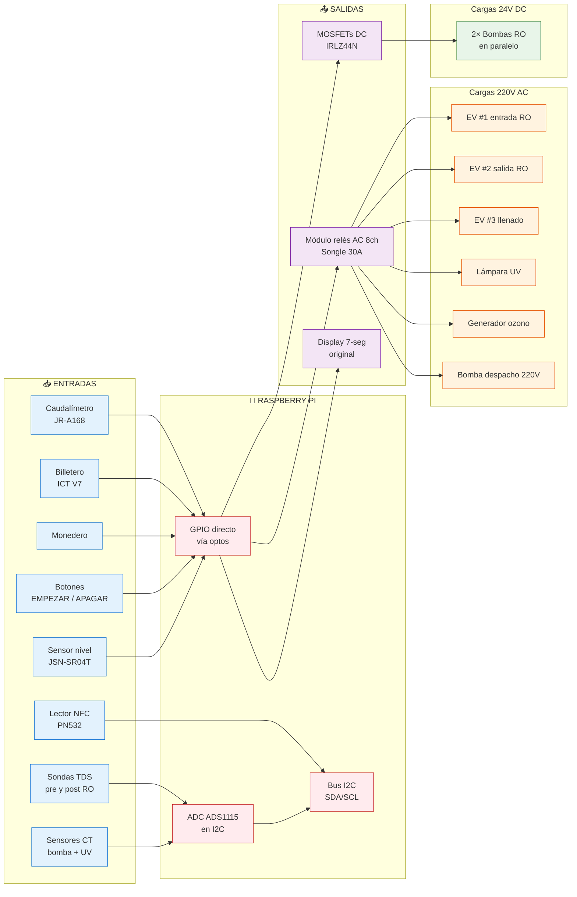
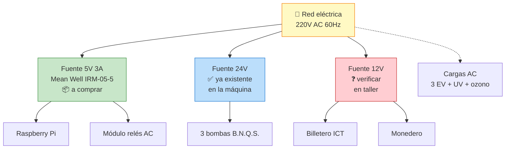
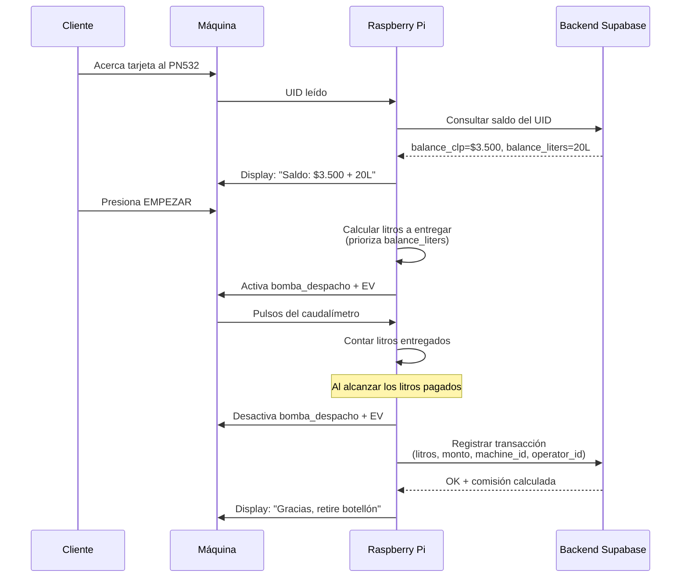

# Esquema de conexiones a Raspberry Pi

Versión: 2026-05-14
Plataforma: Raspberry Pi Zero 2W o Pi 4 (mismo pinout GPIO 40-pin)

## Diagrama visual — Conexiones (Mermaid)



## Distribución de energía



## Flujo de una venta con tarjeta



## Diagrama general

```
                                    ╔═══════════════════════════════╗
                                    ║       RASPBERRY PI            ║
                                    ║   (Zero 2W o Pi 4)            ║
                                    ╚═══════════════════════════════╝
                                              │
        ┌─────────────────────────────────────┼─────────────────────────────────────┐
        │                                     │                                     │
   ENTRADAS (lectura)                  COMUNICACIÓN                          SALIDAS (control)
        │                                     │                                     │
        ▼                                     ▼                                     ▼
```

## ENTRADAS - Sensores y lectores

### Bus I2C (SDA = GPIO 2, SCL = GPIO 3)

```
┌──────────────────┐
│ ADS1115          │ ◄── A0: Sonda TDS pre-RO (0-3.3V)
│ ADC I2C 16-bit   │ ◄── A1: Sonda TDS post-RO (0-3.3V)
│ Addr: 0x48       │ ◄── A2: Sensor corriente SCT-013 bomba RO
└────┬─────────────┘ ◄── A3: Sensor corriente SCT-013 UV
     │ SDA/SCL
     │
┌────┴─────────────┐
│ PN532 RFID/NFC   │ ◄── Tarjeta cliente Socio Kowen
│ Modo I2C         │
│ Addr: 0x24       │
└──────────────────┘
```

**Alternativa PN532 en SPI** (mejor velocidad, libera I2C): MOSI=GPIO10, MISO=GPIO9, SCLK=GPIO11, SS=GPIO8

### Entradas digitales con optoacoplador (aislamiento galvánico)

```
                        ┌─ PC817 ─┐
Billetero ICT           │         │
  PULSE (12V) ──── R1k ─►│ LED  ◄ │── GND billetero
                        │         │
                        │  TR  ──►├── GPIO 17 (Pi, con pull-up)
                        │         │
                        └─────────┘── GND Pi

Monedero
  PULSE (12V) ─── igual ──► GPIO 27

Caudalímetro JR-A168
  PULSE (5V) ──── igual ──► GPIO 22  (también puede ir directo con divisor 5V→3.3V)
```

### Entradas digitales directas (3.3V lógica)

```
Botón EMPEZAR ──────► GPIO 5  (con pull-up interno, leer HIGH→LOW al presionar)
Botón APAGAR ───────► GPIO 6  (idem)

Sensor nivel JSN-SR04T
  TRIG (Pi → sensor) ◄── GPIO 23
  ECHO (sensor → Pi) ──► GPIO 24 (con divisor 5V→3.3V: R1=1kΩ + R2=2kΩ)
```

### Display 7-seg original (pendiente RE)

Si resulta ser **shift register tipo 74HC595**:
```
DATA  ──► GPIO 19
CLOCK ──► GPIO 26
LATCH ──► GPIO 13
```

Si resulta ser **direct multiplex** → considerar microcontrolador esclavo (ATtiny/Arduino Nano) via I2C que maneje el display y reciba comandos.

---

## SALIDAS - Actuadores

### 6 Cargas 220V AC (Módulo de relés Songle 8ch 30A)

```
GPIO 16 ──► IN1 ──► RELÉ 1 ──► EV #1 entrada bombas RO  (220V AC)
GPIO 20 ──► IN2 ──► RELÉ 2 ──► EV #2 salida RO          (220V AC)
GPIO 21 ──► IN3 ──► RELÉ 3 ──► EV #3 llenado botellón   (220V AC)
GPIO 12 ──► IN4 ──► RELÉ 4 ──► Lámpara UV               (220V AC)
GPIO 25 ──► IN5 ──► RELÉ 5 ──► Generador de ozono       (220V AC)
GPIO 4  ──► IN6 ──► RELÉ 6 ──► Bomba de despacho        (220V AC)
GPIO ___ ──► IN7 ──► RELÉ 7 ──► (RESERVA)
GPIO ___ ──► IN8 ──► RELÉ 8 ──► (RESERVA)

Módulo alimentado con 5V dedicado (NO desde el Pi para evitar ruido).
```

### 1 Carga 24V DC (MOSFET de potencia)

```
                          +24V (fuente interna máquina)
                              │
                              │
                              ▼
                       ┌──────┴──────┐
                       │ 2× Bombas   │
                       │ RO en       │  (controladas juntas)
                       │ paralelo    │
                       │ B.N.Q.S.    │
                       └──────┬──────┘
                              │
                              ▼
                       ┌──────┴──────┐
                       │  Diodo      │
                       │  1N5408     │  (flyback, ánodo abajo, cátodo arriba)
                       └──────┬──────┘
                              │
                              ▼
GPIO 18 ──── R 220Ω ──► Gate  D ◄── Drain
                       │     │
                       │ IRLZ44N
                       │     │
                       └─────┴── Source ──► GND
```

La bomba de despacho NO es 24V DC — es 220V AC y va por el RELÉ 6 del módulo Songle (ver sección anterior). Solo hay 1 driver DC (las 2 bombas RO en paralelo).

### Salida de control inhibición billetero

```
GPIO 7 ──► PC817 ──► Inhibit billetero ICT (fuera de servicio remoto)
```

---

## Resumen de uso de GPIO

| GPIO | Función | Tipo |
|---|---|---|
| 2, 3 | I2C (SDA/SCL) | Bus → ADS1115 + PN532 |
| 4 | Relé 6 — Bomba despacho 220V AC | Salida |
| 5 | Botón EMPEZAR | Entrada pull-up |
| 6 | Botón APAGAR | Entrada pull-up |
| 7 | Inhibit billetero | Salida |
| 8, 9, 10, 11 | SPI (si PN532 va en SPI) | Bus |
| 12 | Relé UV | Salida |
| 13 | Display LATCH (si shift register) | Salida |
| 16 | Relé EV #1 entrada | Salida |
| 17 | Pulse billetero | Entrada interrupt |
| 18 | MOSFET bombas RO | Salida |
| 19 | Display DATA | Salida |
| 20 | Relé EV #2 salida RO | Salida |
| 21 | Relé EV #3 llenado | Salida |
| 22 | Pulse caudalímetro | Entrada interrupt |
| 23 | Ultrasonic TRIG | Salida |
| 24 | Ultrasonic ECHO | Entrada |
| 25 | Relé ozono | Salida |
| 26 | Display CLOCK | Salida |
| 27 | Pulse monedero | Entrada interrupt |

GPIO disponibles: 14, 15 (UART), 18 (PWM), libres como reserva.

---

## Distribución de tensiones

```
                          ┌────────────────────────┐
220V AC red ──────────────┤  Fuente Mean Well      │── 5V 3A ──► Pi + módulo relés + lógica
                          │  IRM-05-5              │
                          └────────────────────────┘

                          ┌────────────────────────┐
220V AC red ──────────────┤  Fuente 24V interna    │── 24V ──► Bombas B.N.Q.S. (3)
                          │  (YA EXISTE en máquina)│
                          └────────────────────────┘

                          ┌────────────────────────┐
220V AC red ──────────────┤  Fuente 12V interna    │── 12V ──► Billetero ICT + Monedero
                          │  (verificar si existe) │
                          └────────────────────────┘
                                                          (si no existe, agregar Mean Well IRM-10-12)
```

---

## Notas importantes

1. **Aislamiento galvánico obligatorio** entre billetero/monedero (12V, compartido con AC) y la Pi (3.3V). Usar PC817 siempre, NUNCA conectar directo aunque "el voltaje parezca compatible".

2. **Pull-ups internos del Pi** sirven para botones y entradas con optoacoplador. Habilitar con `pigpio.set_pull_up_down(pin, pigpio.PUD_UP)`.

3. **Módulo de relés alimentado por fuente 5V separada** (no la del Pi). Los relés generan picos de corriente que pueden resetear la Pi si comparten alimentación.

4. **Diodos flyback OBLIGATORIOS** en cada bomba 24V. Sin ellos, el pico inductivo al apagar la bomba quema el MOSFET.

5. **Cables largos** (caudalímetro, sensor ultrasónico) usar par trenzado o blindado para evitar interferencia de las cargas AC en el gabinete.

6. **GND común** entre Pi, ADS1115, optoacopladores (lado Pi), módulo relés. **GND separado** del lado del billetero/monedero (lado opto LED).

---

## Pendiente de confirmar en taller

- [ ] Si la máquina tiene fuente 12V interna para billetero/monedero. Si no, agregar IRM-10-12 al BOM.
- [ ] Voltaje exacto del pulse del caudalímetro JR-A168 (5V o 12V) → ajustar divisor o tipo de optoacoplador.
- [ ] Voltaje exacto del pulse de billetero/monedero → ajustar resistencia limitadora del LED del PC817.
- [ ] Interfaz exacta de los displays 7-seg → ajustar el segmento del esquema correspondiente.

---

## Convertir a imagen

Este esquema en texto se puede convertir a imagen con:
- **Mermaid** (vista preview en VS Code / GitHub): convertir las cajas a sintaxis flowchart
- **draw.io** (manual): copiar las cajas y crear diagrama editable
- **Fritzing**: si quieres esquema realista de protoboard con la Pi y módulos físicos
- **KiCad**: si vas a fabricar PCB custom (post-piloto)
